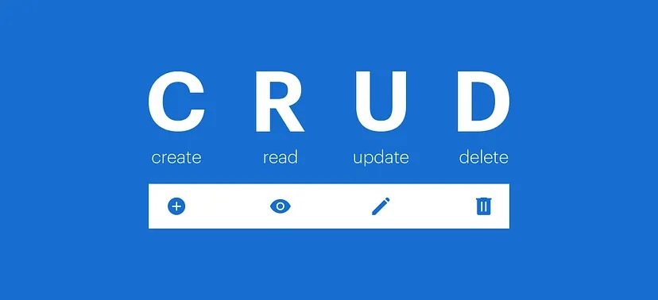
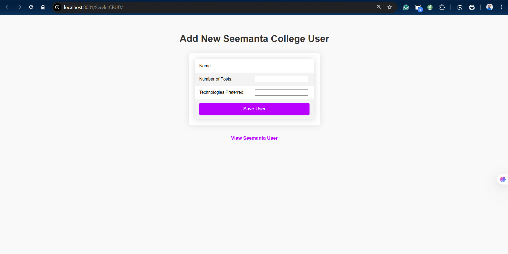
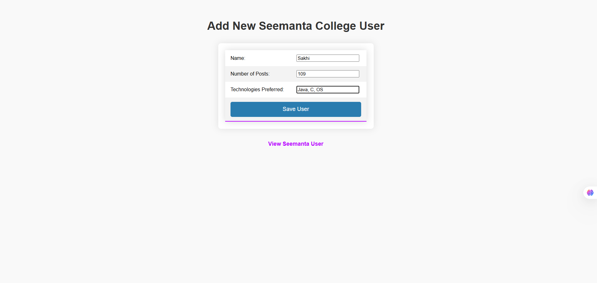
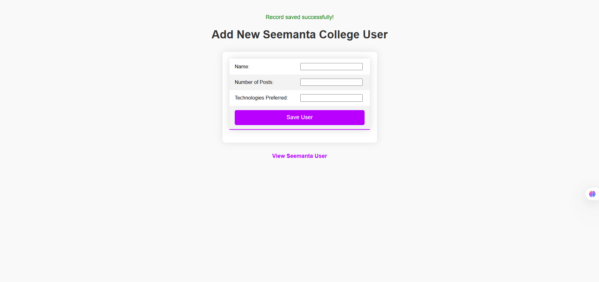
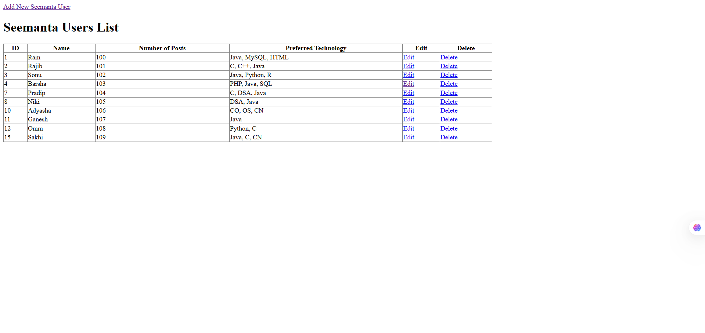
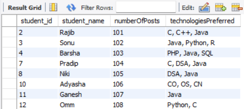

# Servlet CRUD Application (Java + JDBC + Servlet + MySQL)


---
A simple **Servlet-based CRUD (Create, Read, Update, Delete)** web application using **Java Servlets, JDBC, MySQL, and HTML**. This project demonstrates how to perform database operations through a web interface using the MVC-style approach.


---

## 📌 Features

* Add new students
* View all students
* Update student details
* Delete students
* Uses JDBC for database connectivity
* Runs on Apache Tomcat

---

## 🛠️ Technologies Used

* Java (JDK 8+)
* Java Servlets
* JDBC
* MySQL
* HTML
* Apache Tomcat
* IDE: IntelliJ IDEA / Eclipse

---

## 📋 Prerequisites

Before running this project, ensure you have:

* JDK 8 or higher
* Apache Tomcat (9 or above recommended)
* MySQL Server
* MySQL Connector/J (JDBC Driver)

Official Resources:

* Java: [https://www.oracle.com/java/](https://www.oracle.com/java/)
* Apache Tomcat: [https://tomcat.apache.org/](https://tomcat.apache.org/)
* MySQL: [https://www.mysql.com/](https://www.mysql.com/)
* MySQL Connector/J: [https://dev.mysql.com/downloads/connector/j/](https://dev.mysql.com/downloads/connector/j/)

---

## 🗄️ Database Setup

### Step 1: Create Database

```sql
CREATE DATABASE seemanta;
```

### Step 2: Use Database

```sql
USE seemanta;
```

### Step 3: Create Table

```sql
CREATE TABLE stu (
    student_id INT AUTO_INCREMENT PRIMARY KEY,
    student_name VARCHAR(25) NOT NULL,
    numberOfPosts INT DEFAULT 0,
    technologiesPreferred VARCHAR(45)
);
```

---

## 📁 Project Structure

```
ServletCRUD/
│
├── src/main/java/
│   ├── DeleteSeemantaUserServlet.java
│   ├── EditSeemantaUserServlet.java
│   ├── EditSeemantaUserServlet2.java
│   ├── SaveSeemantaUserServlet.java
│   ├── ViewSeemantaUserServlet.java
│   ├── SeemantaUser.java
│   └── SeemantaUserDao.java
│
├── src/main/webapp/
│   ├── index.html
│   └── WEB-INF/
│
├── Libraries/
├── build/
└── README.md
```


---

## ⚙️ Step-by-Step Implementation

### Step 1: HTML Frontend (`index.html`)
- Form to add new student details
- Links to view student records

### Step 2: Model Class (`SeemantaUser.java`)
- Represents student entity
- Contains fields, getters, and setters

### Step 3: DAO Class (`SeemantaUserDao.java`)
- Handles database operations using JDBC
- Includes insert, select, update, and delete methods

### Step 4: Create Servlet (`SaveSeemantaUser.java`)
- Handles **Create** operation
- Reads form data and saves it to database

### Step 5: Read Servlet (`ViewSeemantaUserServlet.java`)
- Handles **Read** operation
- Fetches and displays all student records

### Step 6: Update Form (`EditSeemantaUserServlet.java`)
- Loads existing data into edit form

### Step 7: Update Operation (`EditSeemantaUserServlet2.java`)
- Updates student data in database

### Step 8: Delete Servlet (`DeleteSeemantaUserServlet.java`)
- Deletes student record using ID

---

## ▶️ How to Run the Project
1. Clone the repository
```bash
git clone https://github.com/your-username/Servlet-CRUD.git
````

2. Import project into IntelliJ IDEA or Eclipse

3. Add MySQL Connector/J to project libraries

4. Configure Tomcat Server

5. Update database credentials in DAO class

6. Run the project on Tomcat

7. Open browser and visit:

```
http://localhost:8080/YourProjectName/index.html
```

---

## 📸 Output

* Home Student Form

<br><br>

* Create Student Form

<br><br>
<br><br>
<br><br>

* View Student List
<br><br>


* Edit Student Details
<br><br>

* Delete Student Record
<br><br>


* Database Record

<br><br>

---

## 📚 References

* Java Servlet Documentation: [https://jakarta.ee/specifications/servlet/](https://jakarta.ee/specifications/servlet/)
* JDBC Tutorial (Oracle): [https://docs.oracle.com/javase/tutorial/jdbc/](https://docs.oracle.com/javase/tutorial/jdbc/)
* MySQL Documentation: [https://dev.mysql.com/doc/](https://dev.mysql.com/doc/)

---


